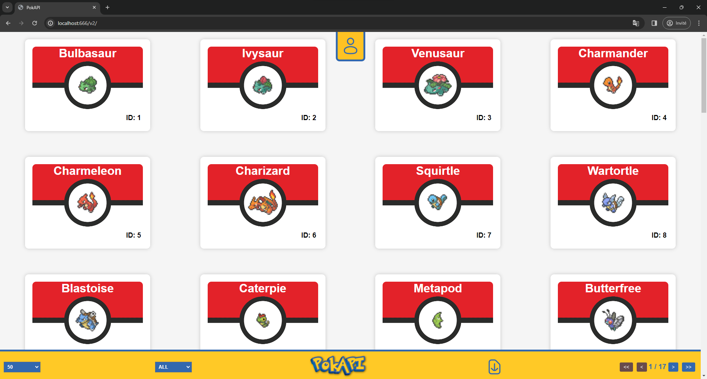
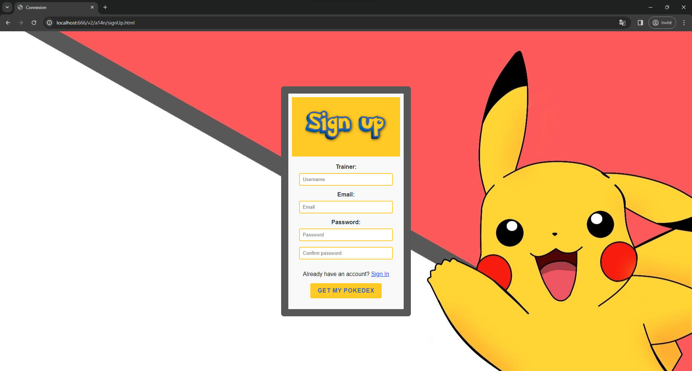
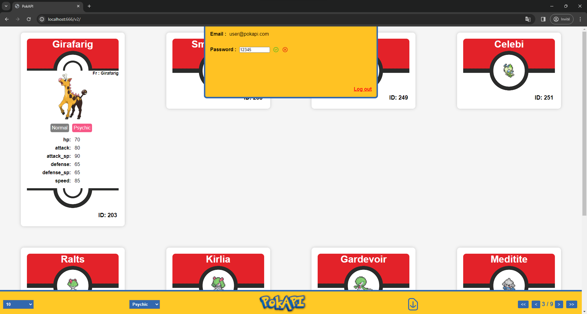
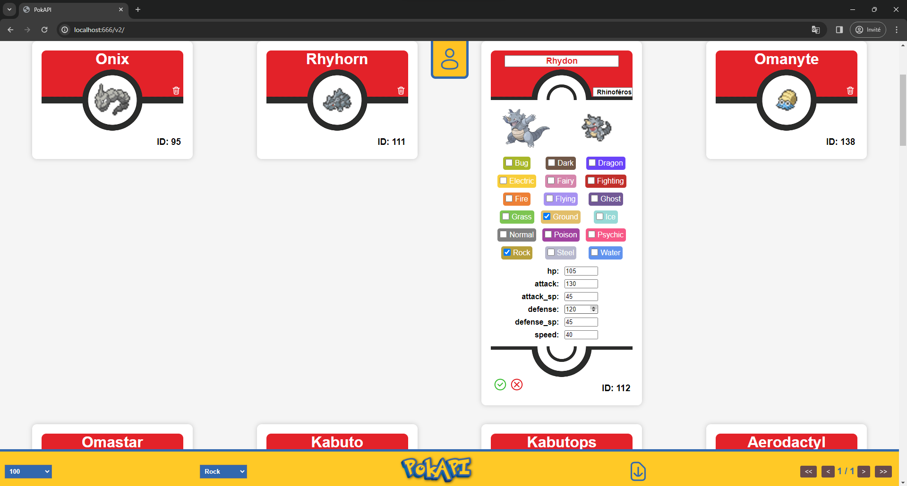

# PokAPI

## Overview
PokAPI is an integrated project encompassing a dynamic web application and a dedicated database, designed to facilitate the exploration and management of a comprehensive Pokémon list. The system supports distinct roles for users and administrators, allowing users to sign up, log in, explore Pokémon with detailed views, utilize a versatile toolbar and access to an Account menu. Administrators benefit from additional features, including the ability to add, delete, and modify Pokémon entries. The project aims to deliver a user-friendly experience while empowering administrators with effective database content management.
> Final Examination for the Development of data exchange services Course (420-5SE-AA / Autumn 2023). Conditions: 90 hours in group of 3, for completion.

## Table of Contents
- [Features](#features)
- [Technologies Used](#technologies-used)
- [Demo](#demo)
- [Getting Started](#getting-started)
- [Database](#database)
- [License](#license)

## Features

- **Tool Bar**: Explore the Pokémon list effortlessly with a versatile toolbar offering navigation options, sorting capabilities, PDF downloads, and easy access to the main menu.

- **Admin Account**: Manage your list of Pokémon efficiently through the admin users.

- **Database Storage**: All essential data, including Pokémon and users, is securely stored in the PostgreSQL database.

## Technologies Used

### Basic

- **HTML**: The backbone of the project, providing the structure for web pages and content.

- **CSS**: Responsible for styling and ensuring a visually appealing and responsive design for an optimal user experience.

- **JavaScript (JS)**: Enhances interactivity and dynamic behavior on the client side, improving user engagement.

- **JSON**: Facilitates data interchange and plays a crucial role in structuring information between the server and the client.

- **Node.js (NodeJS)**: A runtime environment that enables server-side JavaScript execution, allowing for scalable and efficient server-side applications.


- **PostgreSQL**: A powerful relational database management system used to store and manage data related to Pokémon and users.


- **WebStorm**: An Integrated Development Environment (IDE) designed for web development, focusing on JavaScript, TypeScript, HTML, CSS, and related technologies.

- **DataGrip**: A JetBrains IDE for SQL that provides a comprehensive environment for database development, management, and query execution.

### Node modules

- **Express**: A fast, unopinionated, minimalist web framework for Node.js that simplifies the development of robust web applications.

- **Passport**: An authentication middleware for Node.js that supports various authentication strategies, making it easier to implement user authentication.

- **pdfmake**: A JavaScript library for generating PDF documents on the client side, providing flexibility and customization options.

- **Joi**: A powerful schema description language and validator for JavaScript objects, commonly used for data validation.

- **connect-flash**: A middleware for handling flash messages in Express applications, allowing for the easy display of temporary messages to users.

- **crypto**: A Node.js module providing cryptographic functionality, essential for secure data encryption and hashing.

- **Chai**: A BDD/TDD assertion library for Node.js and browsers, making it easier to write clear and expressive tests.

- **Supertest**: A testing library for HTTP assertions, often used with Express applications to test API endpoints and ensure proper functionality.

## Demo





## Getting Started

1. Clone the repository: `git clone https://github.com/MaxenceGuidezCollege/PokAPI.git`
2. Add the environment variables to the configuration as shown below.
    ```
       PGDATABASE=...;
       PGHOST=...;
       PGPASSWORD=...;
       PGPORT=...;
       PGUSER=...;
       PORT=666;
       SCHEMA=...;
       TESTING=false
    ```
3. Run `initDb.js` to create the structure of the database and add Pokémon.
4. Run `addUser.js` or `addAdmin.js`  to add a user or an admin to the database. Alternatively, go to http://localhost:666/v2/a14n/signUp.html to manually add one. Warning! You can't add an admin via the sign-up page; the only way to add an admin is to run the addAdmin.js file.
5. Run `routes.js` to start the API.
6. Go to http://localhost:666/v2/a14n/signIn.html and insert your credentials.
7. Explore and discover all the Pokémon!

## Database

### Tables

Table: pokemons

| Column      | Type           | Description                                   |
|-------------|----------------|-----------------------------------------------|
| id          | INT            | Unique identifier for each Pokémon            |
| name_en     | VARCHAR(255)   | Pokémon name in English                       |
| name_fr     | VARCHAR(255)   | Pokémon name in French                        |
| type        | TEXT[]         | Pokémon types                                 |
| hp          | INT            | Pokémon's health points                       |
| attack      | INT            | Pokémon's attack power                        |
| attack_sp   | INT            | Pokémon's special attack power                |
| defense     | INT            | Pokémon's defense                             |
| defense_sp  | INT            | Pokémon's special defense                     |
| speed       | INT            | Pokémon's speed                               |
| image       | BYTEA          | Pokémon's image                               |
| sprite      | BYTEA          | Pokémon's sprite                              |

Table: users

| Column     | Type                | Description                                      |
|------------|---------------------|--------------------------------------------------|
| id         | INT                 | Unique identifier for each user                  |
| username   | VARCHAR(50)         | User's username                                  |
| email      | VARCHAR(255) UNIQUE | User's unique email address                      |
| pwd_hash   | BYTEA               | Hashed password of the user                      |
| role       | %SCHEMA%.user_type  | User's role (ADMIN, USER)                        |
| created_at | TIMESTAMP           | Account creation date (default: current date)    |
| updated_at | TIMESTAMP           | Last account update date (default: current date) |

### Sequences

```sql
CREATE SEQUENCE %SCHEMA%.pok_id_seq MINVALUE 0 START WITH 0 INCREMENT BY 1;
CREATE SEQUENCE %SCHEMA%.user_id_seq MINVALUE 0 START WITH 0 INCREMENT BY 1;
```
### Enumeration

```sql
CREATE TYPE %SCHEMA%.user_type AS ENUM ('ADMIN', 'USER');
```

## License

This project was made by a group of 3 contributors. The contributors to this project are:

- Migaël Beaudoin
- Vincent Kotarski
- Maxence Guidez

This project is licensed under the MIT License - see the [LICENSE.md](LICENSE.md) file for details.